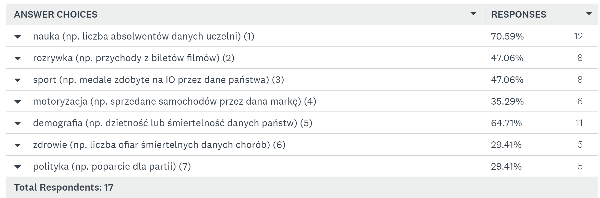
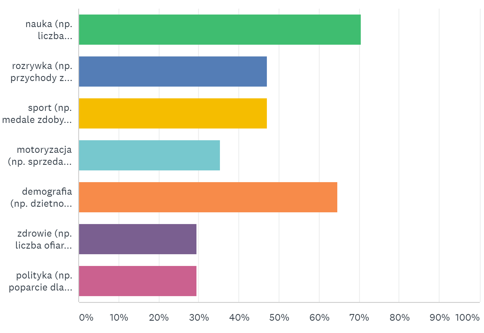
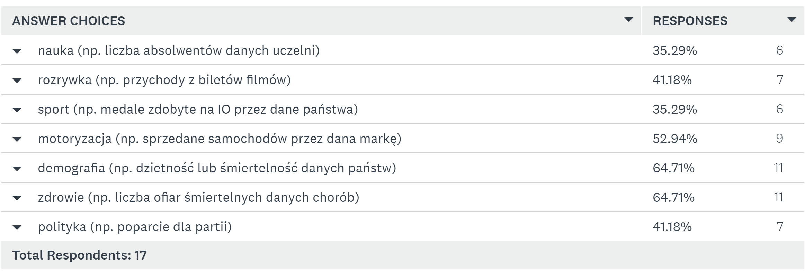
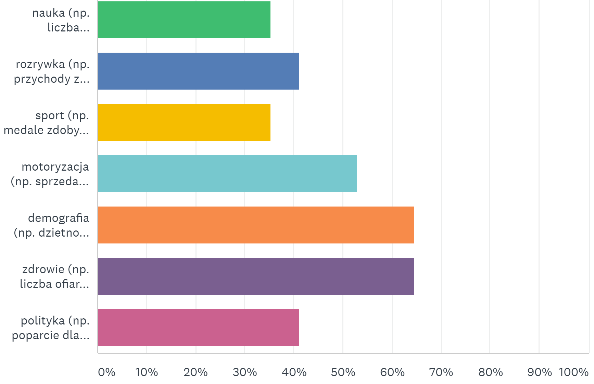
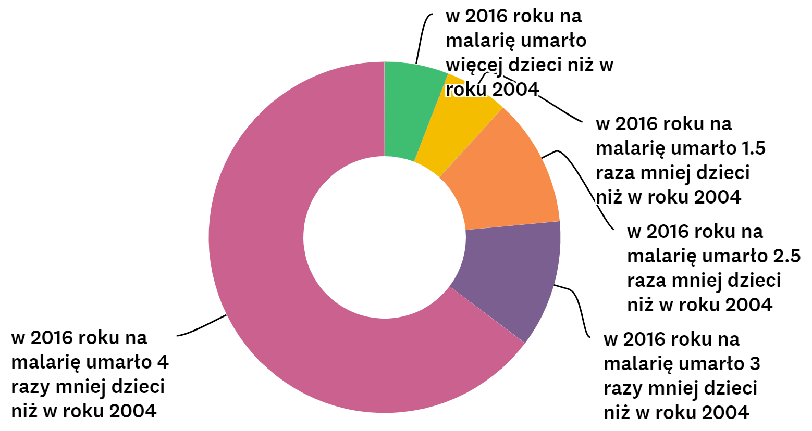
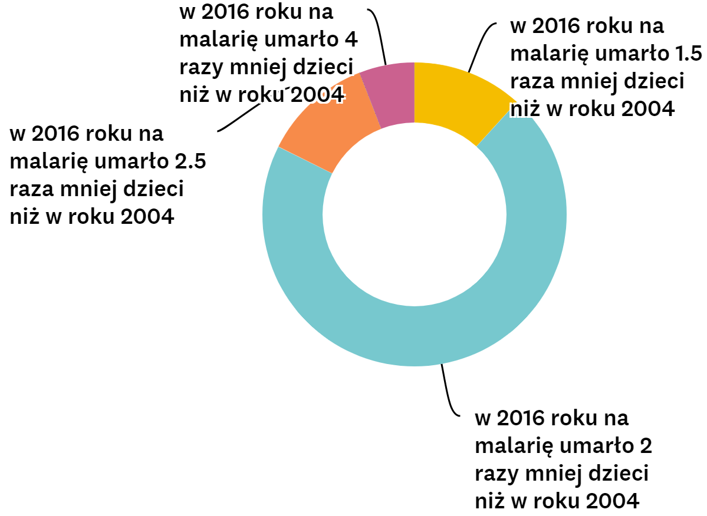

## Analizowane wykresy

Poniżej przedstawiam 3 wykresy, które przedstawiają te same dane, czyli liczbę dzieci, które umarły w latach 2004, 2007, 2010, 2013 oraz 2016 na malarię.

```{r, message=FALSE, echo=FALSE, fig.width=5, fig.height=5}
library(knitr)
library(ggplot2)
knitr::include_graphics(c("Fewer Children Are Dying From Malaria - 1st.png", "Fewer Children Are Dying From Malaria - 2nd.png", "Fewer Children Are Dying From Malaria - 3rd.png"))
```

Na podstawie powyższych wykresów usiłowałem stwierdzić jak duży wpływ na odbiór wykresu ma kolorystyka, w której został utrzymany, a także sprawdzić jak duże różnice w odbiorze danych może wywołać sposób ich prezentacji. 

W tym celu stworzyłem [ankietę](https://www.surveymonkey.com/r/6MRQS2P), która porównuje drugi wykres z trzecim (samą szatę kolorystyczną) mając na celu zbadanie do prezentacji jakich danych najbardziej nadają się kolejne szaty kolorystyczne, z których jedną można określić jako odcienie zieleni, a drugą jako odcienie czerwieni, i czy występuje jakakolwiek zależność pomiędzy kolorystyką wykresu, a danymi, które mogłyby być na nim zaprezentowane. Ponadto, druga część ankiety umożliwiła odpowiedź na pytanie czy z samych wykresów (bez konkretnych liczb) numer 1 i 3 da się odczytać zależności pomiędzy kolejnymi danymi.


## Szata kolorystyczna

Prezentacja wyników dotyczących szaty kolorystycznej wykresu numer 2 (należało wskazać dane, z której kategorii mogłyby z powodzeniem zostać zaprezentowane w danej kolorystyce) w postaci tabelki oraz wykresu: 

```{r, echo=FALSE}


```

Najważniejszą informacją dotyczącą rozważanych 3 wykresów, którą można zdobyć z analizy powyższych danych, jest fakt, że, według ankietowanych, kwestie dotyczące zdrowia sprecyzowane jako liczba ofiar śmiertelnych danych chorób, czyli de facto rzeczywiste dane zaprezentowane na tym wykresie otrzymały najmniej głosów (razem z polityką).


Prezentacja wyników dotyczących szaty kolorystycznej wykresu numer 3. Nalezało wskazać dokładnie te same zagadnienia, co w przypadku wykresu numer 2:

```{r, echo=FALSE}


```

Warto zaobserwować, że w tym przypadku respondenci za najbardziej odpowiedni do przedstawiania w zaprezentowanej szacie kolorystycznej (odcienie czerwonego) zagadnienia związane z, interesującym nas tematem zdrowia, oraz z demografią.

Bardzo istotna jest różnica opinii respondentów na temat odpowiedzi "zdrowie(np. liczba ofiar śmiertelnych danych chorób)", która najpierw znalazła się na ostatnim miejscu wśród preferencji ankietowanych, a w drugim pytaniu awansowała na miejsce pierwsze wśród opinii tych samych ankietowanych.

## Typ zastosowanego wykresu

W tej części ankiety sprawdziłem jak ankietowani poradzili sobie z odpowiedzią na temat prostej zależności, z którą, przy pomocy dobrego wykresu, powinni sobie bez problemu poradzić. Mianowicie mieli określić zależność między dziećmi, które umarły na malarię w roku 2004, a tymi, które umarły na tę samą chorobę w roku 2016. Warto zaznaczyć, że poprawna odpowiedź to: "w 2016 roku na malarię umarło 2.17 raza mniej dzieci niż w roku 2004", więc za wystarczające należało uznać zarówno odpowiedź "(...)2 razy(...)" oraz "(...)2.5 raza(...)".
Do tego porównania użyłem wykresu pierwszego oraz wykresu trzeciego.

Wyniki w przypadku pierwszego wykresu:


```{r, echo=FALSE}

```

Podstawowym wynioskiem, który należy wysnuć z tej części ankiety to fakt, że zdecydowana większość ankietowanych prawie dwukrotnie przesacowała rzeczywisty wynik, a jedynie około 10% respondentów udzieliło odpowiedzi uznawanej za poprawną.

Wyniki w przypadku wykresu trzeciego:

```{r, echo=FALSE}

```


Należy zauważyć, że tym razem ci sami ankietowani poprawnie odczytali zależności w ponad 80% przypadków i tylko jeden respondent bardzo mocno przesacował wynik zaznaczając odpowiedź "(...)4 razy(...)". Wnioskiem z tego może być tylko fakt, że wykres trzeci dużo lepiej prezentuje zależności pomiędzy danymi niż wykres pierwszy.

## Podsumowanie

Po pierwsze okazało się, że kolory mają bardzo istotne znaczenie przy tworzeniu wykresów, a w tym konkretnym przypadku nieporównywalnie lepiej sprawdziło się spektrum koloru czerwonego niż spektrum koloru zielonego. 

Ponadto udało mi się zaobserwować, że wybór typu wykresu jest kluczowy w kwestii odbioru zależności na nim przedstawiownych przez odbiorców. Problem pierwszego wykresu polegał przede wszystkim na tym, że prezentował on wyniki tak jakby był zwykłym wykresem słupkowym, tzn istotna była jedynie wysokość kolejnych kwadratów, chociaż odbiorcy interpetowali go tak jakby zależność została ukazana poprzez pola, co wbrew pozorom nie było zamiarem autorów.